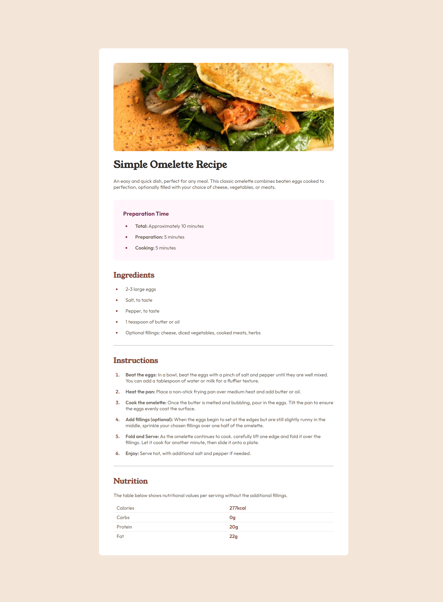

# Frontend Mentor - Recipe page solution

This is a solution to the [Recipe page challenge on Frontend Mentor](https://www.frontendmentor.io/challenges/recipe-page-KiTsR8QQKm). Frontend Mentor challenges help me improve my coding skills by building realistic projects.

## Table of contents

- [Overview](#overview)
  - [The challenge](#the-challenge)
  - [Screenshot](#screenshot)
  - [Links](#links)
- [My process](#my-process)
  - [Built with](#built-with)
  - [What I learned](#what-i-learned)
  - [Continued development](#continued-development)
  - [Useful resources](#useful-resources)
- [Author](#author)


## Overview

### Screenshot



### Links

- Solution URL: [github.com/RayyanNafees/fm-lvl-1](https://github.com/RayyanNafees/fm-lvl-1)
- Live Site URL: [rayyannafees.github.io/fm-lvl-1](https://rayyannafees.github.io/fm-lvl-1)

## My process

I started out by first defining all the colors & typography to my [themes.css](./src/themes.css) file with al the default styles. And then added all the markup roughly in the html and started customizing each section individually in [style.css](./src/style.css)

### Built with

- Semantic HTML5 markup
- CSS pseudo elements
- CSS pseudo selectors
- Mobile-first workflow

### What I learned

#### 1. List Markers

I learnt using the `li::marker` CSS selector for customizing lists

```css
li::marker {
  color: papayawhip;
}
```

#### 2. Bordered tables

I learnt on how to create those beautiful bordered tables

```css
table {
  border-collapse: collapse;
  width: 100%;

  td {
    border-bottom: 1px solid var(--light-grey);
    padding: 0.5ch 1ch;
  }

  tr:last-child td {
    border-bottom: none;
  }
}
```

### Continued development

I want to continue my learning and development practice on mobile-first & responsive units & media queries

### Useful resources

- [CSS tricks li element](https://css-tricks.com/list-style-recipes/) - This helped me knowing how to style the list marker.
- [A Guide to Styling Tables](https://dev.to/madsstoumann/a-guide-to-styling-tables-28d2?ref=dailydev) - This is an amazing article which helped me finally understand customizing tables. I'd recommend it to anyone still learning this concept.

## Author

- Website - [RayyanNafees](https://rayyannafees.github.io)
- Frontend Mentor - [@RayyanNafees](https://www.frontendmentor.io/profile/RayyanNafees)
- Twitter - [@NafeesRayyan](https://www.twitter.com/NafeesRayyan)
- Github - [RayyanNafees](https://github.com/RayyanNafees)
